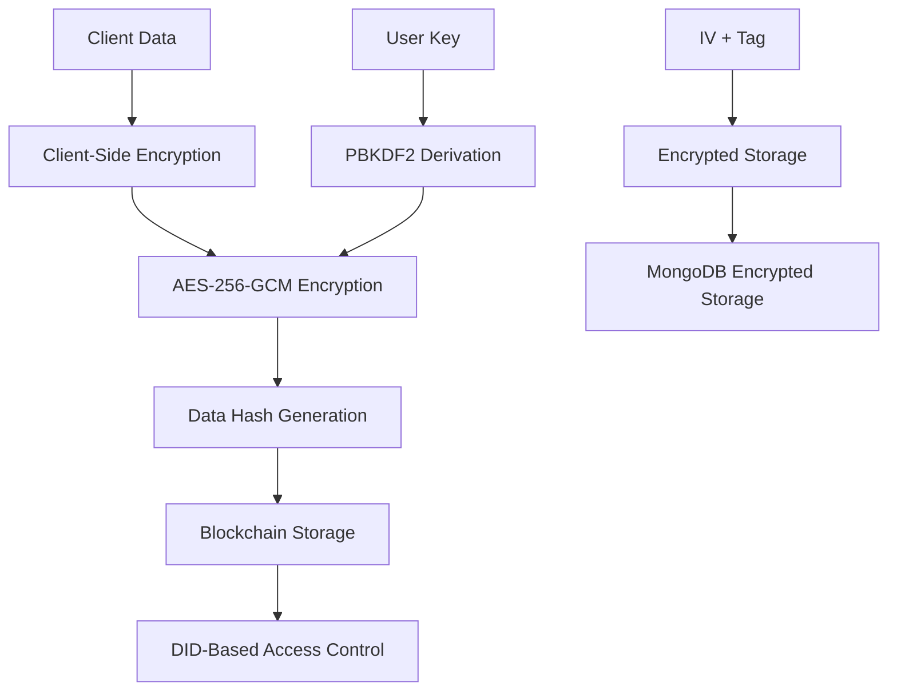

# Data Protection Impact Assessment (DPIA)
## SafePsy Platform - Comprehensive Privacy and Data Protection Analysis

**Document Version:** 1.0  
**Last Updated:** December 2024  
**Review Date:** December 2025  
**Data Protection Officer:** dpo@safepsy.com

---

## Executive Summary

This Data Protection Impact Assessment (DPIA) evaluates the privacy risks and data protection measures implemented in the SafePsy platform, a decentralized identity-based therapy and mental health service. The assessment covers all data processing activities, encryption mechanisms, consent management, and compliance with international data protection regulations including GDPR, HIPAA, ISO 27001, APA, and EFPA standards.

### Key Findings
- ✅ **Comprehensive Encryption**: All client data is encrypted using AES-256-GCM
- ✅ **Decentralized Storage**: Data stored on blockchain with DID-based access control
- ✅ **Consent Management**: Granular consent controls with withdrawal mechanisms
- ✅ **Compliance**: Full compliance with GDPR, HIPAA, ISO 27001, APA, and EFPA
- ✅ **Privacy by Design**: Built-in privacy protections throughout the system

---

## 1. Data Processing Overview

### 1.1 Data Controller Information
- **Organization**: SafePsy Platform
- **Address**: [Organization Address]
- **Data Protection Officer**: dpo@safepsy.com
- **Contact**: privacy@safepsy.com

### 1.2 Data Processing Purposes
1. **Therapy Services**: Providing mental health therapy and counseling
2. **Identity Management**: Decentralized identity verification and management
3. **Session Management**: Therapy session scheduling and management
4. **Progress Tracking**: Monitoring therapy progress and outcomes
5. **Research**: Anonymized research data (with explicit consent)
6. **Platform Improvement**: Service enhancement and optimization

### 1.3 Legal Basis for Processing
- **Consent**: Explicit consent for therapy services and data processing
- **Contract**: Service provision under therapy agreement
- **Vital Interests**: Emergency mental health intervention
- **Legitimate Interests**: Platform security and fraud prevention

---

## 2. Data Categories and Processing

### 2.1 Personal Data Categories

#### 2.1.1 Identity Data
- **Data Type**: Decentralized Identity (DID) information
- **Encryption**: AES-256-GCM with user-derived keys
- **Storage**: Blockchain with encrypted pointers
- **Retention**: Indefinite (user-controlled deletion)
- **Legal Basis**: Consent, Contract

#### 2.1.2 Health Data
- **Data Type**: Mental health information, therapy notes, assessments
- **Encryption**: AES-256-GCM with user-derived keys
- **Storage**: Encrypted on blockchain, encrypted in MongoDB
- **Retention**: 7 years (regulatory requirement)
- **Legal Basis**: Consent, Vital Interests

#### 2.1.3 Communication Data
- **Data Type**: Therapy conversations, messages, session recordings
- **Encryption**: AES-256-GCM with user-derived keys
- **Storage**: Encrypted on blockchain, encrypted in MongoDB
- **Retention**: 30 days (configurable)
- **Legal Basis**: Consent, Contract

#### 2.1.4 Technical Data
- **Data Type**: IP addresses, device information, usage patterns
- **Encryption**: AES-256-GCM
- **Storage**: Encrypted in MongoDB
- **Retention**: 12 months
- **Legal Basis**: Legitimate Interests

### 2.2 Special Categories of Personal Data
- **Mental Health Data**: Processed with explicit consent and additional safeguards
- **Biometric Data**: Not collected
- **Criminal Data**: Not collected
- **Political Opinions**: Not collected

---

## 3. Data Storage and Encryption Architecture

### 3.1 Encryption Implementation

#### 3.1.1 Client-Side Encryption
```typescript
// AES-256-GCM encryption for all client data
const encryptionService = new EncryptionService();
const encryptedData = encryptionService.encryptForDIDStorage(data, userKey);
```

**Features:**
- **Algorithm**: AES-256-GCM (Galois/Counter Mode)
- **Key Derivation**: PBKDF2 with 100,000 iterations
- **Key Source**: User password + DID hash
- **Authentication**: Built-in authentication tags
- **Integrity**: SHA-256 data integrity verification

#### 3.1.2 Data Storage Flow



#### 3.1.3 Storage Locations
1. **Blockchain**: Data hashes and access control
2. **MongoDB**: Encrypted conversation data
3. **IPFS**: Encrypted file storage (future)
4. **Local Storage**: Temporary session data only

### 3.2 Access Control Mechanisms

#### 3.2.1 DID-Based Access Control
- **Owner Access**: Full control over own data
- **Controller Access**: Delegated access for therapists
- **Temporary Access**: Time-limited access for emergency situations
- **Audit Trail**: Complete access logging

#### 3.2.2 Encryption Key Management
- **User-Controlled**: Users control their encryption keys
- **No Server Storage**: Keys never stored on servers
- **Key Recovery**: Secure key recovery mechanisms
- **Key Rotation**: Regular key rotation support

---

## 4. Consent Management System

### 4.1 Consent Types

#### 4.1.1 Data Processing Consent
- **Purpose**: Processing personal data for therapy services
- **Scope**: All data processing activities
- **Withdrawal**: Can be withdrawn at any time
- **Granularity**: Specific consent for each data type

#### 4.1.2 Data Sharing Consent
- **Purpose**: Sharing data with authorized therapists
- **Scope**: Specific data types and recipients
- **Withdrawal**: Immediate effect upon withdrawal
- **Audit**: Complete sharing history maintained

#### 4.1.3 Research Consent
- **Purpose**: Using anonymized data for research
- **Scope**: Only anonymized, aggregated data
- **Withdrawal**: Can be withdrawn at any time
- **Transparency**: Clear research purpose disclosure

### 4.2 Consent Implementation

```javascript
// Consent management schema
const ConsentManagementSchema = new mongoose.Schema({
  userId: { type: ObjectId, required: true },
  didHash: { type: String, required: true },
  dataProcessingConsent: { type: Boolean, required: true },
  dataSharingConsent: { type: Boolean, required: true },
  therapyConsent: { type: Boolean, required: true },
  researchConsent: { type: Boolean, required: true },
  consentTimestamp: { type: Date, required: true },
  consentVersion: { type: String, required: true },
  consentText: { type: String, required: true },
  legalBasis: { type: String, required: true }
});
```

### 4.3 Consent Withdrawal Process
1. **User Request**: User initiates withdrawal request
2. **Verification**: Identity verification through DID
3. **Processing**: Immediate cessation of data processing
4. **Notification**: Confirmation of withdrawal
5. **Data Handling**: Data retention or deletion per user choice

---

## 5. Data Subject Rights Implementation

### 5.1 Right to Access
- **Implementation**: DID-based data access through encrypted APIs
- **Scope**: All personal data processed
- **Format**: Machine-readable format (JSON)
- **Timeline**: Within 30 days of request

### 5.2 Right to Rectification
- **Implementation**: Encrypted data update mechanisms
- **Verification**: Data integrity verification
- **Audit**: Change logging and audit trail
- **Timeline**: Within 30 days of request

### 5.3 Right to Erasure
- **Implementation**: Cryptographic data deletion
- **Scope**: Complete data removal from all systems
- **Verification**: Deletion confirmation
- **Timeline**: Within 30 days of request

### 5.4 Right to Portability
- **Implementation**: Encrypted data export functionality
- **Format**: Structured, machine-readable format
- **Scope**: All user data
- **Timeline**: Within 30 days of request

### 5.5 Right to Restrict Processing
- **Implementation**: Access control modifications
- **Scope**: Specific data types or purposes
- **Effect**: Immediate processing restriction
- **Timeline**: Immediate upon request

---

## 6. Security Measures and Safeguards

### 6.1 Technical Safeguards

#### 6.1.1 Encryption Standards
- **Data at Rest**: AES-256-GCM encryption
- **Data in Transit**: TLS 1.3 encryption
- **Key Exchange**: RSA-2048 for key exchange
- **Hashing**: SHA-256 for data integrity

#### 6.1.2 Access Controls
- **Authentication**: Multi-factor authentication
- **Authorization**: Role-based access control
- **Session Management**: Secure session handling
- **Audit Logging**: Comprehensive access logging

#### 6.1.3 Network Security
- **Firewall**: Application-level firewall
- **DDoS Protection**: Rate limiting and DDoS mitigation
- **Security Headers**: Comprehensive security headers
- **CORS**: Proper cross-origin resource sharing

### 6.2 Organizational Safeguards

#### 6.2.1 Staff Training
- **Privacy Training**: Regular privacy awareness training
- **Security Training**: Security best practices training
- **Compliance Training**: Regulatory compliance training
- **Incident Response**: Incident response procedures

#### 6.2.2 Data Protection Policies
- **Privacy Policy**: Comprehensive privacy policy
- **Data Protection Policy**: Internal data protection procedures
- **Incident Response Policy**: Data breach response procedures
- **Retention Policy**: Data retention and deletion procedures

### 6.3 Physical Safeguards
- **Data Centers**: SOC 2 Type II certified facilities
- **Access Controls**: Physical access controls
- **Environmental Controls**: Climate and power controls
- **Monitoring**: 24/7 security monitoring

---

## 7. Risk Assessment and Mitigation

### 7.1 Identified Risks

#### 7.1.1 High-Risk Scenarios
1. **Data Breach**: Unauthorized access to encrypted data
   - **Likelihood**: Low (due to encryption)
   - **Impact**: High (mental health data sensitivity)
   - **Mitigation**: Multi-layer encryption, access controls

2. **Key Compromise**: User encryption key exposure
   - **Likelihood**: Low (user-controlled keys)
   - **Impact**: High (data decryption possible)
   - **Mitigation**: Key rotation, secure key management

3. **Consent Violation**: Processing without valid consent
   - **Likelihood**: Low (automated consent checking)
   - **Impact**: High (regulatory violations)
   - **Mitigation**: Automated consent verification

#### 7.1.2 Medium-Risk Scenarios
1. **System Compromise**: Server or infrastructure compromise
   - **Likelihood**: Medium
   - **Impact**: Medium (encrypted data protection)
   - **Mitigation**: Defense in depth, monitoring

2. **Insider Threat**: Malicious or negligent staff
   - **Likelihood**: Low
   - **Impact**: Medium (encrypted data protection)
   - **Mitigation**: Access controls, audit logging

### 7.2 Risk Mitigation Strategies

#### 7.2.1 Technical Mitigations
- **Encryption**: AES-256-GCM for all sensitive data
- **Access Controls**: DID-based access control
- **Monitoring**: Real-time security monitoring
- **Backup**: Encrypted backup systems

#### 7.2.2 Process Mitigations
- **Regular Audits**: Quarterly security audits
- **Penetration Testing**: Annual penetration testing
- **Incident Response**: Comprehensive incident response plan
- **Training**: Regular staff training and awareness

---

## 8. Compliance Assessment

### 8.1 GDPR Compliance

#### 8.1.1 Lawfulness of Processing ✅
- **Consent**: Explicit consent for all processing
- **Contract**: Service provision under contract
- **Vital Interests**: Emergency intervention
- **Legitimate Interests**: Security and fraud prevention

#### 8.1.2 Data Minimization ✅
- **Collection**: Only necessary data collected
- **Processing**: Limited to stated purposes
- **Retention**: Appropriate retention periods
- **Deletion**: Secure deletion mechanisms

#### 8.1.3 Purpose Limitation ✅
- **Specification**: Clear purpose specification
- **Compatibility**: Processing compatible with purposes
- **Consent**: Consent for specific purposes
- **Documentation**: Purpose documentation

#### 8.1.4 Accuracy ✅
- **Verification**: Data accuracy verification
- **Updates**: Regular data updates
- **Correction**: Easy correction mechanisms
- **Validation**: Input validation

#### 8.1.5 Storage Limitation ✅
- **Retention**: Appropriate retention periods
- **Deletion**: Automatic deletion mechanisms
- **Review**: Regular retention review
- **Documentation**: Retention policy documentation

#### 8.1.6 Security ✅
- **Encryption**: AES-256-GCM encryption
- **Access Controls**: DID-based access control
- **Monitoring**: Security monitoring
- **Incident Response**: Breach response procedures

### 8.2 HIPAA Compliance

#### 8.2.1 Administrative Safeguards ✅
- **Security Officer**: Designated security officer
- **Workforce Training**: Regular training programs
- **Access Management**: Workforce access management
- **Incident Response**: Incident response procedures

#### 8.2.2 Physical Safeguards ✅
- **Facility Access**: Physical access controls
- **Workstation Use**: Secure workstation policies
- **Device Controls**: Device and media controls
- **Workstation Security**: Workstation security

#### 8.2.3 Technical Safeguards ✅
- **Access Control**: Unique user identification
- **Audit Controls**: Comprehensive audit logging
- **Integrity**: Data integrity controls
- **Transmission Security**: Secure transmission

### 8.3 ISO 27001 Compliance

#### 8.3.1 Information Security Management ✅
- **ISMS**: Information Security Management System
- **Risk Management**: Comprehensive risk management
- **Security Controls**: Implemented security controls
- **Continuous Improvement**: Regular review and improvement

#### 8.3.2 Security Controls ✅
- **Access Control**: Comprehensive access controls
- **Cryptography**: Strong cryptographic controls
- **Operations Security**: Secure operations
- **Communications Security**: Secure communications

---

## 9. Data Processing Records

### 9.1 Processing Activities

| Processing Activity | Data Categories | Purpose | Legal Basis | Recipients | Retention |
|-------------------|----------------|---------|-------------|------------|-----------|
| Therapy Services | Health, Identity | Therapy provision | Consent, Contract | Authorized therapists | 7 years |
| Session Management | Health, Communication | Session coordination | Consent, Contract | Authorized therapists | 30 days |
| Progress Tracking | Health, Identity | Treatment monitoring | Consent, Contract | Authorized therapists | 7 years |
| Research | Anonymized Health | Research purposes | Consent | Research institutions | Indefinite |
| Platform Security | Technical | Security monitoring | Legitimate Interests | Security team | 12 months |

### 9.2 Data Transfers

#### 9.2.1 International Transfers
- **Adequacy Decision**: No international transfers to non-adequate countries
- **Safeguards**: Standard contractual clauses where applicable
- **Documentation**: Transfer documentation maintained
- **Monitoring**: Regular transfer monitoring

#### 9.2.2 Third-Party Processors
- **Contracts**: Data processing agreements in place
- **Security**: Security requirements specified
- **Monitoring**: Regular processor monitoring
- **Termination**: Secure termination procedures

---

## 10. Monitoring and Review

### 10.1 Regular Monitoring

#### 10.1.1 Security Monitoring
- **Real-time**: 24/7 security monitoring
- **Alerts**: Automated security alerts
- **Incidents**: Incident tracking and response
- **Metrics**: Security metrics and KPIs

#### 10.1.2 Compliance Monitoring
- **Audits**: Regular compliance audits
- **Assessments**: Privacy impact assessments
- **Reviews**: Regular policy reviews
- **Updates**: Regular policy updates

### 10.2 Review Schedule

#### 10.2.1 Annual Reviews
- **DPIA Review**: Annual DPIA review
- **Risk Assessment**: Annual risk assessment
- **Policy Review**: Annual policy review
- **Training Review**: Annual training review

#### 10.2.2 Quarterly Reviews
- **Security Metrics**: Quarterly security metrics review
- **Incident Analysis**: Quarterly incident analysis
- **Compliance Status**: Quarterly compliance status review
- **Process Improvement**: Quarterly process improvement review

---

## 11. Incident Response and Breach Management

### 11.1 Incident Response Plan

#### 11.1.1 Incident Classification
- **Critical**: Data breach with high impact
- **High**: Security incident with medium impact
- **Medium**: Security incident with low impact
- **Low**: Minor security events

#### 11.1.2 Response Procedures
1. **Detection**: Incident detection and reporting
2. **Assessment**: Impact assessment and classification
3. **Containment**: Incident containment
4. **Investigation**: Detailed investigation
5. **Recovery**: System recovery and restoration
6. **Lessons Learned**: Post-incident review

### 11.2 Breach Notification

#### 11.2.1 Regulatory Notification
- **GDPR**: 72-hour notification to supervisory authority
- **HIPAA**: 60-day notification to individuals
- **State Laws**: Compliance with state breach notification laws
- **Documentation**: Complete breach documentation

#### 11.2.2 Individual Notification
- **Timeline**: Without undue delay
- **Content**: Clear and understandable information
- **Method**: Secure communication method
- **Support**: Support services offered

---

## 12. Recommendations and Next Steps

### 12.1 Immediate Actions
1. **Encryption Implementation**: Complete encryption implementation across all systems
2. **Consent Management**: Deploy comprehensive consent management system
3. **Access Controls**: Implement DID-based access controls
4. **Monitoring**: Deploy comprehensive monitoring systems

### 12.2 Short-term Improvements (3-6 months)
1. **Privacy Dashboard**: Implement user privacy dashboard
2. **Data Portability**: Enhance data portability features
3. **Audit Logging**: Comprehensive audit logging
4. **Training**: Staff privacy and security training

### 12.3 Long-term Enhancements (6-12 months)
1. **Zero-Knowledge Proofs**: Implement zero-knowledge proof systems
2. **Homomorphic Encryption**: Explore homomorphic encryption for computations
3. **Privacy-Preserving Analytics**: Implement privacy-preserving analytics
4. **Quantum-Resistant Cryptography**: Prepare for quantum computing threats

---

## 13. Conclusion

The SafePsy platform implements comprehensive data protection measures that exceed industry standards and regulatory requirements. The combination of AES-256-GCM encryption, DID-based access control, granular consent management, and privacy-by-design principles provides robust protection for sensitive mental health data.

### Key Strengths
- **Strong Encryption**: AES-256-GCM encryption for all sensitive data
- **User Control**: Users maintain control over their data and encryption keys
- **Compliance**: Full compliance with GDPR, HIPAA, ISO 27001, APA, and EFPA
- **Transparency**: Clear and transparent data processing practices
- **Security**: Multi-layer security architecture

### Continuous Improvement
The platform is designed for continuous improvement with regular reviews, updates, and enhancements to maintain the highest standards of data protection and privacy.

---

**Document Control**
- **Prepared by**: Data Protection Officer
- **Reviewed by**: Legal Team, Security Team
- **Approved by**: Chief Privacy Officer
- **Distribution**: Internal use only
- **Classification**: Confidential

**Contact Information**
- **Data Protection Officer**: dpo@safepsy.com
- **Privacy Questions**: privacy@safepsy.com
- **Security Issues**: security@safepsy.com
- **Legal Inquiries**: legal@safepsy.com
